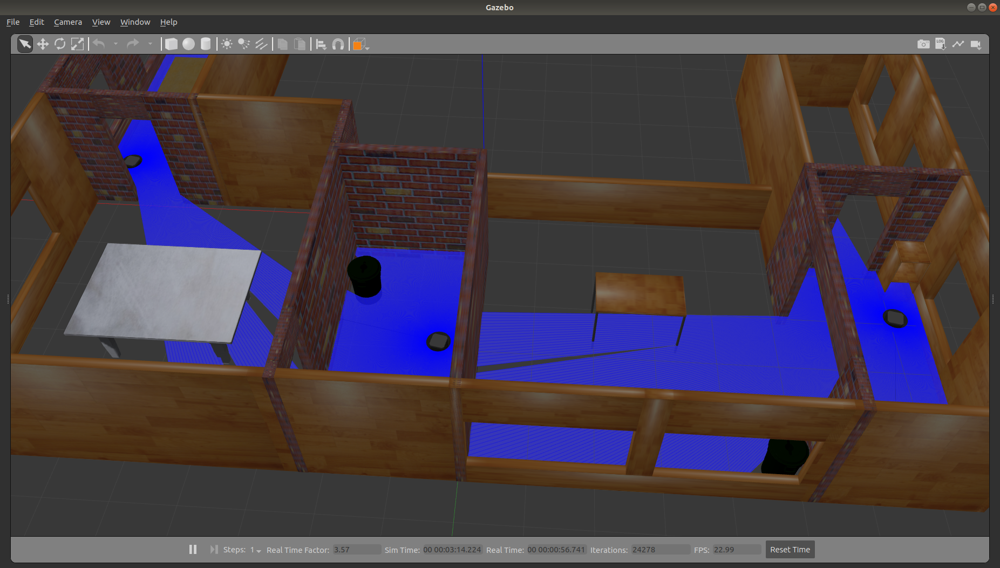
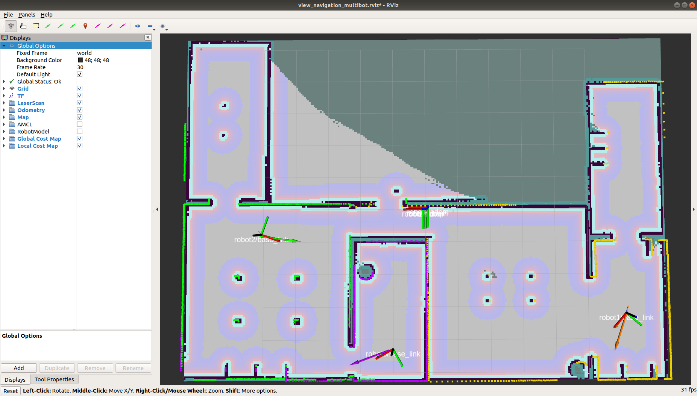
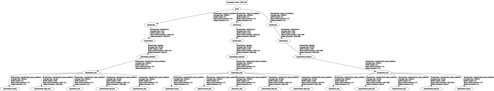

# NeuronBot2 Swarm Examples

Gazebo view:


Rviz view:


TF tree:


## Download and install dependencies
```bash
mkdir -p ~/nb2_swarm_ws/src
cd ~/nb2_swarm_ws/
wget https://raw.githubusercontent.com/Adlink-ROS/neuronbot2_multibot/melodic-devel/nb2_swarm.repos
vcs import src < nb2_swarm.repos
rosdep install --from-path src --ignore-src -r -y --rosdistro melodic
```

## Build code
```bash
source /opt/ros/melodic/setup.bash
cd ~/nb2_swarm_ws/
catkin_make
```

## Run NeuronBot2 multibot
```bash
source /opt/ros/melodic/setup.bash
source ~/nb2_swarm_ws/devel/setup.bash
roslaunch neuronbot2_multibot start.launch
```

Note:
1. If it's your first time to run start.launch, it may take few minutes to download gazebo model.

2. Running this example in Gazebo simulation requires a little bit high computing power, Intel Core i5/i7 CPU is recommended.
